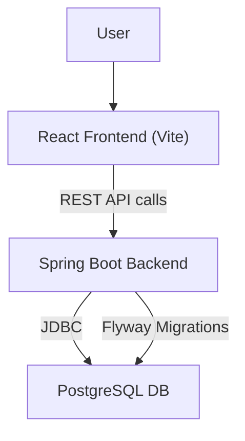

# Inventory Management System (IMS) – Comprehensive Overview

## Table of Contents
1. Introduction
2. System Architecture
3. Backend Functionality
4. Frontend Functionality
5. Data Model & Database
6. API Endpoints
7. Extensibility & Enhancement Guidelines
8. DevOps & Deployment
9. Testing Strategy
10. Further Enhancements

---

## 1. Introduction
The IMS is a cloud-native, enterprise-grade inventory management platform built with Java (Spring Boot) for the backend and React.js (with Vite) for the frontend. It is designed for scalability, maintainability, and extensibility, following best practices in software engineering.

---

## 2. System Architecture
- **Backend:** Java 11, Spring Boot, layered architecture (Controller → Service → Repository), PostgreSQL, Flyway for migrations.
- **Frontend:** React.js (functional components), Vite, Tailwind CSS, modular folder structure.
- **DevOps:** Dockerized, supports CI/CD, environment-based configuration.

### High-Level Architecture Diagram

---

## 3. Backend Functionality
- **Product Management:** CRUD for products (name, SKU, category, price, description).
- **Warehouse Management:** CRUD for warehouses (name, location).
- **Inventory Management:** Track product quantities per warehouse.
- **Purchase Orders:**
  - Create purchase orders (supplier, product name, warehouse name, quantity, etc.)
  - Fulfill purchase orders (updates inventory, marks as received)
- **Validation:** JSR-380 bean validation on DTOs.
- **Exception Handling:** Global handler for REST errors.
- **DTOs & Mappers:** Clean separation between entities and API contracts.
- **Pagination:** (To be implemented for large lists)
- **OpenAPI/Swagger:** Auto-generated API docs.

### Technical Details
- **Layered Architecture:**
  - Controller: Handles HTTP requests, returns DTOs.
  - Service: Business logic, transaction management.
  - Repository: JPA repositories for DB access.
- **Error Handling:**
  - All exceptions are caught by a global handler and returned as structured JSON errors.
  - Validation errors return 400 with field-level messages.
- **Security:**
  - (Planned) JWT-based authentication, role-based access control.
  - Input validation and output encoding to prevent injection attacks.
- **Database Migrations:**
  - All schema changes are managed via Flyway SQL scripts.
- **Extensibility:**
  - New modules follow the same pattern: Entity → Repository → Service → Controller → DTOs.

---

## 4. Frontend Functionality
- **Product Module:**
  - List, create, edit products
  - Responsive forms with validation
- **Warehouse Module:**
  - List, create, edit warehouses
- **Inventory Module:**
  - List, create, edit inventory records
- **Purchase Order Module:**
  - List all purchase orders
  - Create purchase order (select product/warehouse by name)
  - Fulfill purchase order (mark as received)
  - UI: Each module has a "Create" button, table views, and feedback for actions
- **Routing:** React Router for navigation
- **Reusable Hooks & Components:** For API calls, forms, and tables
- **Styling:** Tailwind CSS for consistent, responsive design

### Technical Details
- **API Integration:**
  - All API calls are made via dedicated service files using fetch/axios.
  - Error handling is centralized; user feedback is shown for all failed actions.
- **Form Validation:**
  - Uses controlled components and validation logic for required fields and types.
- **Navigation:**
  - React Router v6 for page navigation and route protection (future: auth guards).
- **Component Structure:**
  - Pages under `src/pages/`, reusable UI under `src/components/`.
- **State Management:**
  - Local state via hooks; can be extended to use Context or Redux for larger apps.

---

## 5. Data Model & Database
- **Product:** id (UUID), name, SKU, category, price, description, timestamps
- **Warehouse:** id (UUID), name, location
- **Inventory:** id, product_id (FK), warehouse_id (FK), quantity, timestamps
- **PurchaseOrder:** id (UUID), supplier_name, product_name, warehouse_name, quantity, order_date, user_id, status, received_at, received_by
- **Migrations:** Managed by Flyway, SQL scripts in `src/main/resources/db/migration`

---

## 6. API Endpoints
- RESTful endpoints under `/api/`
- Example:
  - `GET /api/products`, `POST /api/products`, `PUT /api/products/{id}`
  - `GET /api/warehouses`, `POST /api/warehouses`, `PUT /api/warehouses/{id}`
  - `GET /api/inventory`, `POST /api/inventory`, `PUT /api/inventory/{id}`
  - `GET /api/purchase-orders`, `POST /api/purchase-orders`, `POST /api/purchase-orders/{id}/fulfill`
- See `03-api-endpoints.md` for full details

---

## 7. Extensibility & Enhancement Guidelines
- **Backend:**
  - Follow layered architecture and SOLID principles
  - Add new modules by creating new Entity, Repository, Service, Controller, and DTO classes
  - Use Flyway for DB changes (create new migration files)
  - Use global exception handling for new error types
- **Frontend:**
  - Add new pages/components under `src/pages/` and `src/components/`
  - Use hooks for API logic, keep UI modular
  - Follow existing folder and naming conventions
- **General:**
  - Keep business logic in services, not controllers
  - Use DTOs for all API input/output
  - Write unit and integration tests for new features

---

## 8. DevOps & Deployment
- **Docker:** Multi-stage builds for backend and frontend
- **.dockerignore:** Used to optimize Docker context
- **CI/CD:** (Recommended) Use GitHub Actions or similar for build/test/deploy
- **Environment Variables:** Use for DB credentials, API URLs, etc.

---

## 9. Testing Strategy
- **Backend:** JUnit + Mockito for services, MockMvc for controllers, validation tests for DTOs
- **Frontend:** Jest + React Testing Library for components and hooks
- **Test Coverage:** Ensure all business logic and API endpoints are covered

---

## 10. Further Enhancements
- User authentication & authorization (JWT, roles)
- Pagination, filtering, and search for large datasets
- Audit logging and activity tracking
- Advanced reporting and analytics
- Bulk import/export (CSV, Excel)
- Notification system (email/SMS on order events)
- API rate limiting and security hardening
- Cloud deployment (AWS, Azure, GCP)

---

**This document provides a single source of truth for the IMS project. For any enhancement, refer to this overview to understand the architecture, data flow, and best practices.**